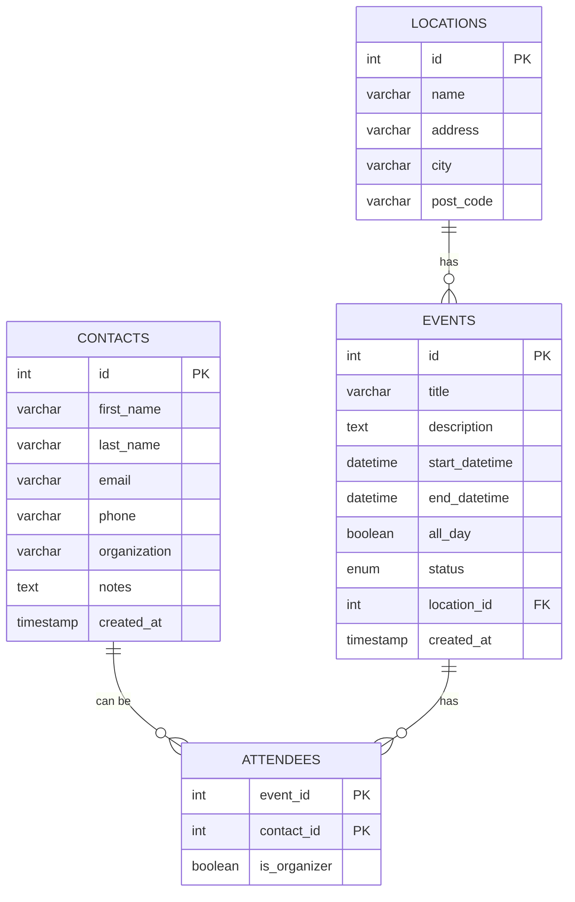

# My Calendar Application (Backend)

A RESTful API for an event management system

## Dependencies / Libraries
- Spring Boot 3.2.0
- Spring Data JPA
- MySQL
- Lombok
- Jakarta EE 

## Build Instructions (Linux)

#### Setup
1. Clone the repo
2. Check Maven and JDK 17+ are installed (install if not)
3. In `application.properties` configure MySQL database credentials
    *(Note: I have set up mine to match system variables `MARIA_USERNAME` and
    `MARIA_PASSWORD`, which are set up in my systems `.bashrc`)


#### Clean Install
```bash
mvn clean install
```

#### Run Application
will run on `http://localhost:8080` *(though this can also be changed in
`application.properties` if you would like to use a different port*)
```bash
mvn spring-boot:run
```

## Database Schema

#### Summary

- the application manages a **MySQL** database instance called `calendardb`
- `calendardb` has **tables** `contacts`, `locations`, `events`, and `attendees` 

#### ER Diagram


## API Endpoints

### Contacts

|   Method  |   Endpoint                                |   Description         |
|-----------|-------------------------------------------|-----------------------|
|   GET     | /api/contacts                             | get all             |   
|   GET     | /api/contacts/{id}                        | get by ID           |
|   GET     | /api/contacts/search?name={name}          | search by name      |
|   GET     | /api/contacts/search?organization={org}   | search by org       |
|   POST    | /api/contacts                             | create new          |
|   PUT     | /api/contacts/{id}                        | update              |
|   DELETE  | /api/contacts{id}                         | delete              |

POST to `/api/contacts`
```json
{
  "firstName": "First",
  "lastName": "Last",
  "email": "first.last@example.com",
  "phone": "207-555-1234",
  "organization": "Business Corp",
  "notes": "this is a note"
}
```

### Locations

|   Method  |   Endpoint                                |   Description         |
|-----------|-------------------------------------------|-----------------------|
| GET       | /api/locations                            | get all               |
| GET       | /api/locations/{id}                       | get by ID             |
| GET       | /api/locations/by-city?city={city}        | get by city           |
| POST      | /api/locations                            | get new               |
| PUT       | /api/locations/{id}                       | update                |
| DELETE    | /api/locations/{id}                       | delete                |


POST to `/api/locations`
```json
{
  "name": "The Building",
  "address": "123 Business St",
  "city": "Place",
  "postCode": "12345"
}
```

### Events

| Method    |       Endpoint                                    |   Description         |
|-----------|---------------------------------------------------|-----------------------|
| GET       | /api/events                                       | get all               |
| GET       | /api/events/{id}                                  | get by ID             |
| GET       | /api/events/by-status?status={status}             | get by status         |
| GET       | /api/events/by-location?locationId={locationId}   | get by location       |
| GET       | /api/events/by-date-range?start={start}&end={end} | get by date range     |
| POST      | /api/events                                       | get new               |
| PUT       | /api/events/{id}                                  | update                |
| DELETE    | /api/events/{id}                                  | delete                |

POST to `/api/events`
```json
{
  "title": "Special Event",
  "description": "it will be important",
  "startDatetime": "2025-07-11T10:00:00",
  "endDatetime": "2025-07-11T12:00:00",
  "allDay": false,
  "status": "CONFIRMED",
  "locationId": 1
}
```


### Attendees

|   Method  |           Endpoint                                                    |   Description             |
|-----------|-----------------------------------------------------------------------|---------------------------|
| GET       | /api/events/{eventId}/attendees                                       | get all                   |
| GET       | /api/events/{eventId}/attendees/organizers                            | get organizers            |
| POST      | /api/events/{eventId}/attendees                                       | add to event              |
| PUT       | /api/events/{eventId}/attendees/{contactId}?isOrganizer={true/false}  | update organizer status   |
| DELETE    | /api/events/{eventId}/attendees/{contactId}                           | remove from event         |

POST to `/api/events/{eventId}/attendees`
```json
{
  "contactId": 1,
  "isOrganizer": false
}
```

